# AWS ETL Pipeline with Terraform

This project implements a simple AWS-based ETL pipeline that ingests a healthcare dataset, performs basic data transformation using AWS Glue, and writes analytics-ready data back to Amazon S3. Infrastructure is provisioned using Terraform.

---

## Architecture Overview

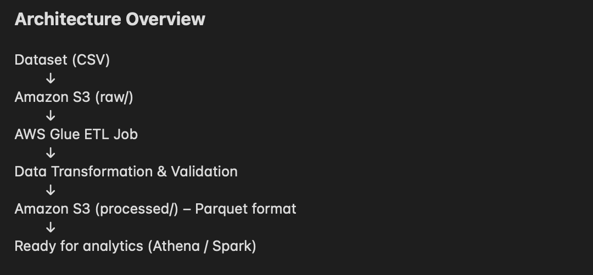

---

## Project Structure

```text
.
├── data/
│   └── patient_adherence_dataset.csv
│
├── glue/
│   └── patient_adherence_etl.py
│
├── terraform/
│   ├── providers.tf
│   ├── variables.tf
│   ├── main.tf
│   └── outputs.tf
│
├── images/
│   └── deployment screenshots
│
└── README.md
```

## Technologies Used

- AWS S3
- AWS Glue
- Terraform
- Python (PySpark)
- AWS CLI

## Design Considerations

This pipeline was intentionally designed using a simple raw-to-processed S3 layout to mimic a typical data lake ingestion pattern. The Glue job performs lightweight data validation and transformation, converting the raw CSV dataset into Parquet format to improve storage efficiency and query performance for downstream analytics tools such as Amazon Athena or Spark.

## Setup and Deployment Instructions

### Prerequisites
- AWS account with permissions for S3, IAM, and Glue
- AWS CLI configured (`aws configure`)
- Terraform v1.0+

### Dataset
- Dataset: Patient Adherence Dataset (Kaggle)
- Source: https://www.kaggle.com/datasets/vipulshahi/patient-adherence-dataset
- File in this repo: `data/patient_adherence_dataset.csv`

### Deploy Infrastructure
From project root:

```bash
cd terraform
terraform init
terraform apply
```

Terraform creates:
- S3 bucket: `patient-etl-pipeline-bucket-demo`
- IAM role + S3 access policy for Glue
- Glue job: `patient-adherence-etl-job`
- S3 objects:
  - `raw/patient_adherence_dataset.csv`
  - `scripts/patient_adherence_etl.py`

### Deployment Evidence
Terraform init:
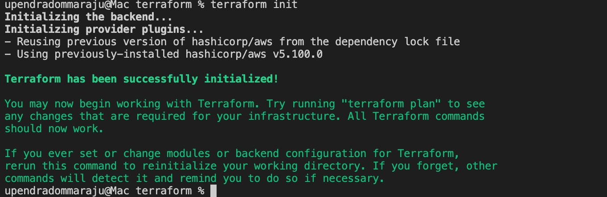

Terraform apply:
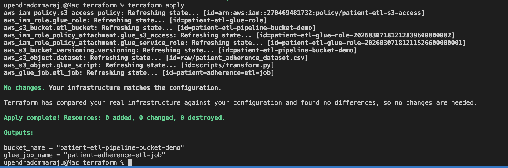

Terraform plan (no changes):
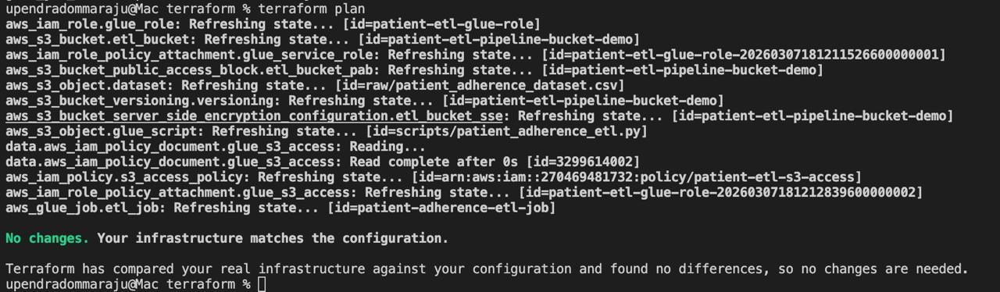

Bucket created:
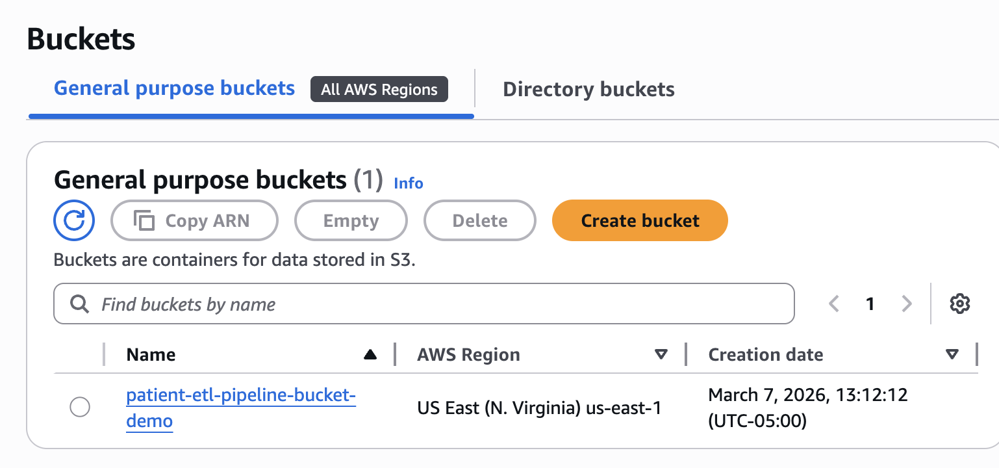

Folders created (`raw/`, `scripts/`, `processed/`):
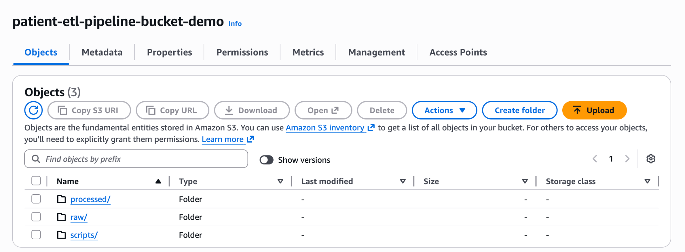

Raw file uploaded:
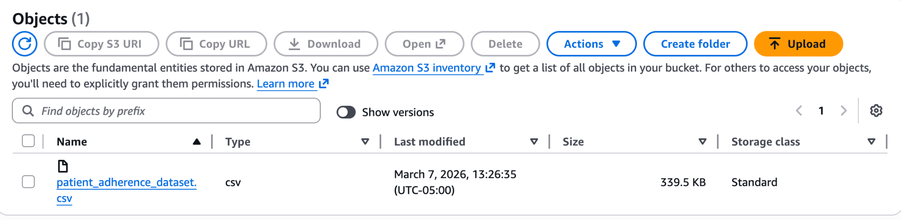

Glue script uploaded (`patient_adherence_etl.py`):
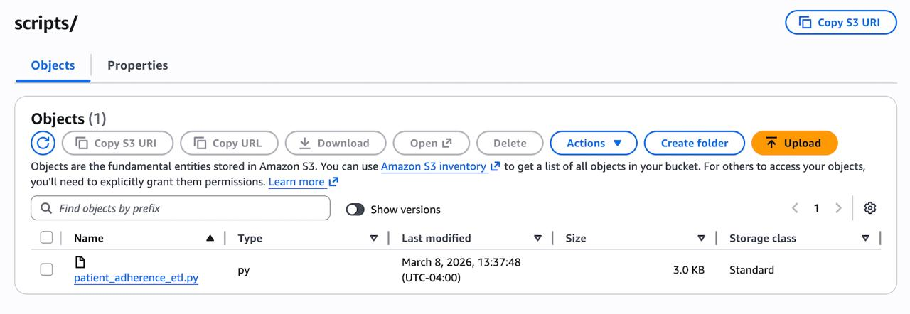

## How to Run the Pipeline

### 1. Start Glue Job
```bash
aws glue start-job-run --job-name patient-adherence-etl-job
```
Screenshot:
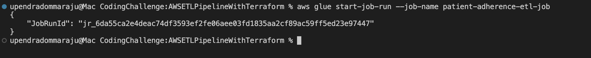

### 2. Check Job Status
```bash
aws glue get-job-run \
  --job-name patient-adherence-etl-job \
  --run-id <JOB_RUN_ID> \
  --query 'JobRun.JobRunState'
```
Screenshot:
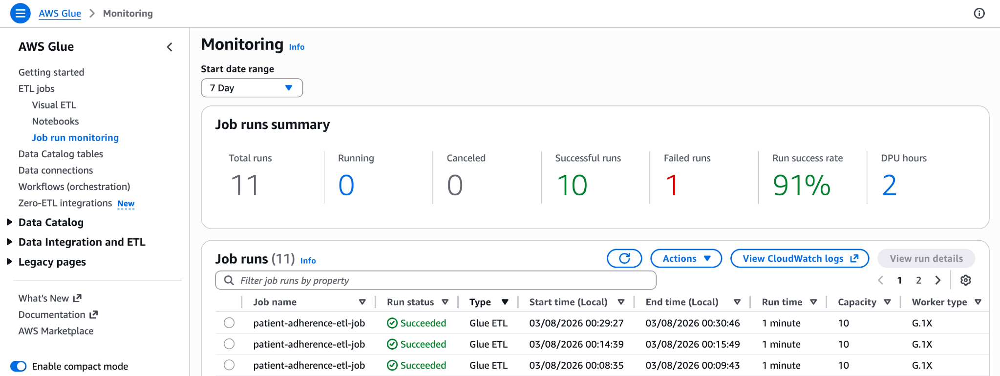
Note: One earlier run failed because the Glue role was missing `s3:DeleteObject`, which overwrite mode needs before writing new Parquet files.

### 3. Verify Output
```bash
aws s3 ls s3://patient-etl-pipeline-bucket-demo/processed/ --recursive
```
Expected location:
- `s3://patient-etl-pipeline-bucket-demo/processed/`

Screenshot:
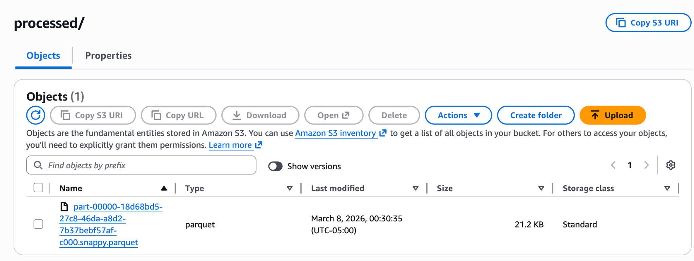

## Assumptions and Design Decisions
- I kept the scope simple: one dataset and one Glue job.
- I used a basic S3 layout:
  - `raw/` for source CSV
  - `processed/` for transformed Parquet files
- Terraform passes `--input_path` and `--output_path` to the Glue job.
- In the transform script, I validate required columns and drop bad rows.
- I normalize categorical text to lowercase and add a derived `risk_level` column.
- I used Parquet because it is smaller and faster to query in Athena/Spark.
- Cost note: the Glue job uses Glue `4.0`, `timeout = 10` minutes, and `max_concurrent_runs = 1` to keep challenge runs predictable.
- On March 8, 2026, the Glue job succeeded and wrote Parquet files to `processed/`.

## Tradeoffs
- I kept this as a single Glue script with a simple S3 `raw/` -> `processed/` flow so the solution stays easy to review for challenge scope.
- I did not add orchestration (Step Functions), Data Catalog/Crawlers, or full monitoring/alerting to avoid extra infrastructure beyond the assignment requirements.

## Author
Upendra Dommaraju
